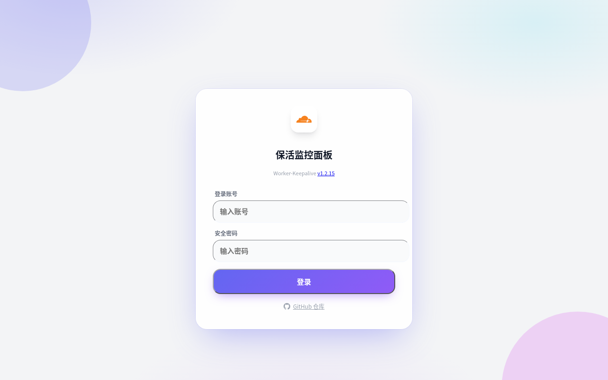
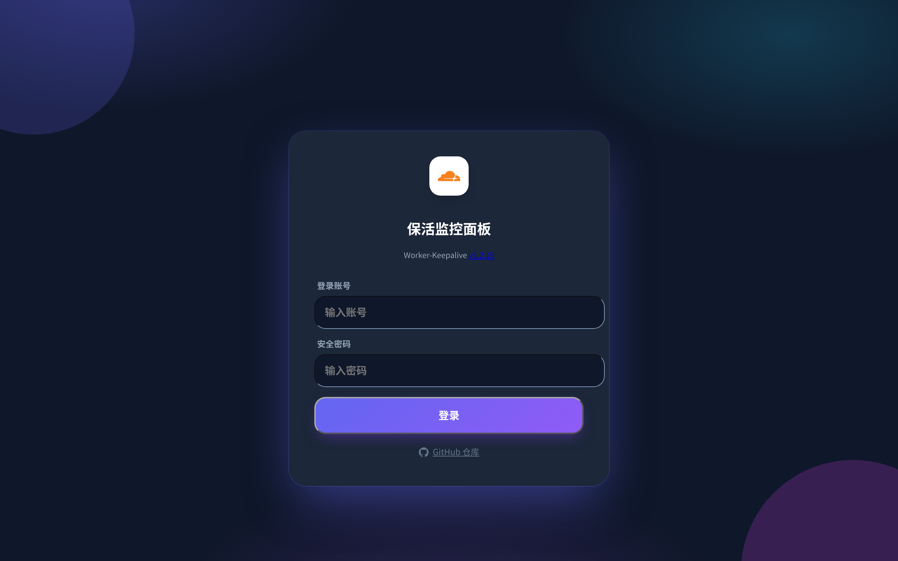
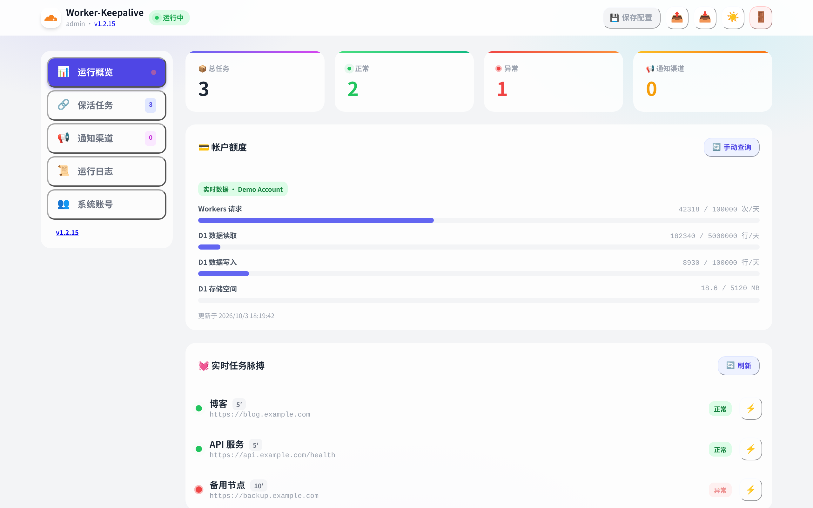
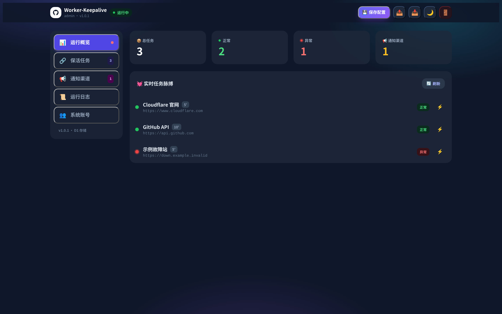
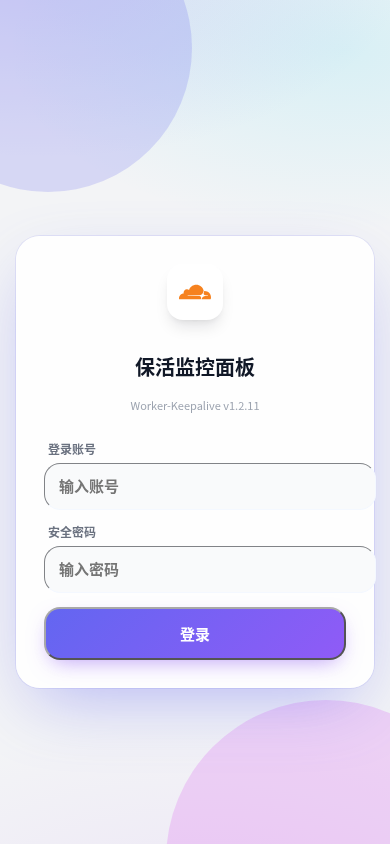
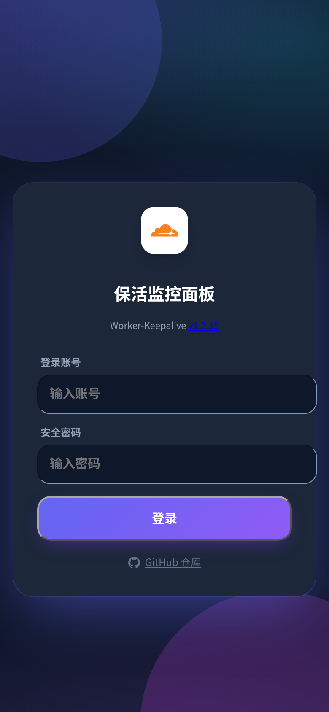
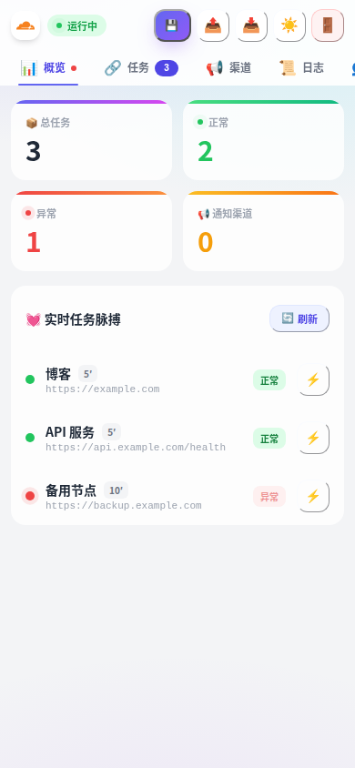
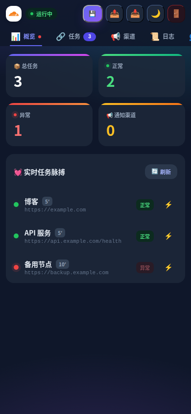

# Worker-Keepalive v1.1.0

站点保活管理系统（Cloudflare Worker + D1）。

定时探测 URL 是否存活，挂了就按任务推送告警。自带 Web 管理面板，手机和电脑都能用。

## 目录

- [预览](#预览)
- [部署](#部署)
  - [环境变量](#环境变量)
- [上手流程](#上手流程)
- [各页面说明](#各页面说明)
- [探测和通知规则](#探测和通知规则)
- [常见问题](#常见问题)
- [改代码后重新打包](#改代码后重新打包)

## 预览

| | 浅色模式 | 深色模式 |
|---|---|---|
| 电脑端登录 |  |  |
| 电脑端运行概览 |  |  |
| 移动端登录 |  |  |
| 移动端运行概览 |  |  |

## 部署

**方式一：复制代码（最简单）**

1. 打开 `worker.js` 全选复制（约 320KB，Vue + 样式已内联，零外部依赖）
2. Cloudflare 面板 → Workers → 创建 → 粘贴代码 → 部署
3. 绑定 D1：变量名必须叫 `DB`（表会自动建，不用手动执行 SQL）
4. 添加 Cron Trigger，例如 `*/5 * * * *`
5. 设置变量后重新部署，打开域名用 Root 账号登录

**方式二：wrangler**

```bash
git clone https://github.com/replycore/Worker-Keepalive.git
cd Worker-Keepalive
npx wrangler d1 create keepalive-db
# 把输出的 database_id 填入 wrangler.toml
npx wrangler secret put ADMIN_USER
npx wrangler secret put ADMIN_PASS
npx wrangler deploy
```

### 环境变量

| 变量 | 说明 | 默认 |
|---|---|---|
| `ADMIN_USER` | Root 账号 | `admin` |
| `ADMIN_PASS` | Root 密码；换了之后所有已登录会被踢下线 | `admin` |
| `LOG_LEVEL` | 日志记录范围：`all` 全部记，`failed` 只记失败，`off` 不记 | `failed` |

首次部署后立刻把 `admin / admin` 改掉。

## 上手流程

1. 登录 → 2.「通知渠道」页添加推送渠道 → 3.「保活任务」页添加任务并勾选渠道 → 4. 点右上角「💾 保存配置」

**增删改任务、渠道后都要点「保存配置」才会真正写入 D1**，否则刷新就丢了。页面有未保存的修改时会显示"更改待保存"。

## 各页面说明

### 运行概览

- 四张统计卡：总任务 / 正常 / 异常 / 通知渠道
- 任务脉搏：每个任务一行，显示状态、间隔和上次探测时间，点 ⚡ 可单独手动探测
- 「上次探测」每 60 秒自动刷新一次，不用手动点刷新
- 💳 帐户额度卡：登录后自动查询一次，右上角可手动刷新；未在「账号」页配置 Cloudflare API 时显示演示数据

### 保活任务

- 字段：任务名称、完整 URL（带 http(s)://）、轮询间隔（分钟）、通知渠道（可多选）
- 新增表单在页面顶部的折叠面板里；每张任务卡片上有探测 / 编辑 / 删除三个按钮
- 勾选多张卡片后可以「批量渠道」一次性分配通知渠道，或批量删除
- 手动点 ⚡ 探测：立即请求一次 URL，更新状态和上次探测时间，结果用弹窗告诉你
- 状态为 down 的任务会显示红色「故障中」

### 通知渠道

共 10 种，每种要填的不一样，添加后建议先点「测试」确认能收到：

| 类型 | 要填的 |
|---|---|
| Telegram 机器人 | Bot Token、Chat ID |
| Bark | Device Key（自建服务器可填 URL） |
| PushPlus | Token |
| NotifyX | API 密钥 |
| 钉钉 / 飞书 | Webhook URL（加签 Secret 选填） |
| Resend 邮件 | API Key、发件邮箱、收件邮箱 |
| Gotify | Server URL、App Token |
| Ntfy | Server URL、Topic |
| 自定义 Webhook | URL（Headers JSON 选填） |

### 运行日志

- 只保留最近 100 条，多的自动删最早的
- 每条有时间、任务名、正常/异常、详情、触发方式（自动 / 手动）
- 右上角可按「日志范围」切换 `LOG_LEVEL`，可一键清空

### 系统账号

- Root 账号来自环境变量 `ADMIN_USER`，只能在这里看，不能改
- 可以添加 / 删除子账号，子账号名不能和 Root 同名
- 登录 Session 有效期 7 天；`ADMIN_PASS` 一换，所有人都要重新登录
- ☁️ Cloudflare API：在「账号」页填写 Account ID 与 API Token（Token 只存 D1，面板上留空表示不修改），可测试连接；配置后「运行概览」的帐户额度显示真实数据

## 探测和通知规则

- 定时任务按 Cron 触发（默认每 5 分钟）；每个任务按自己的「轮询间隔」决定这次轮不轮到它
- 探测就是 GET 请求一次 URL，HTTP 2xx 算正常，其他都算异常；每次探测都会更新状态和「上次探测」时间
- **只在状态变化时推送**：正常→异常发告警，异常→恢复发通知；一直挂着不会重复轰炸，一直正常不打扰
- **失败日志按阶梯记录**：连续失败只在第 1 / 3 / 33 / 333 … 次记一条（注明"连续第 N 次失败"），其余跳过，避免离线日志风暴
- **连续失败满 7 天自动停跑**：不再请求该任务 URL，任务卡片显示"已暂停"；点 ⚡ 手动探测可恢复（成功则清零，失败则从第 1 次重新计）
- 手动探测同样遵守通知规则，每次都会记一条日志

## 常见问题

- **页面一直转圈**：8 秒还没加载出来会显示红色提示，刷新重试即可
- **API 报 500 `D1 database not bound`**：D1 没绑定或变量名不是 `DB`
- **子账号密码是哈希存 D1 的**（SHA-256 + 随机 salt）；要对外暴露请在前面加 Cloudflare Access

## 改代码后重新打包

只改了 `worker.js` 里的前端/后端逻辑后执行（需要先 `npm i`）：

```bash
npm run build
```

直接用 zip 包部署的用户：改完重新打包 `worker.js` 即可，复制即部署。
